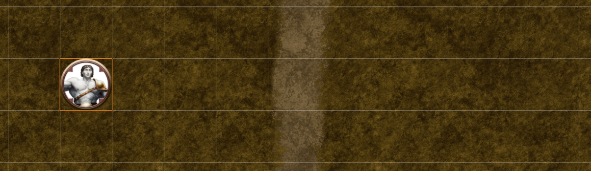
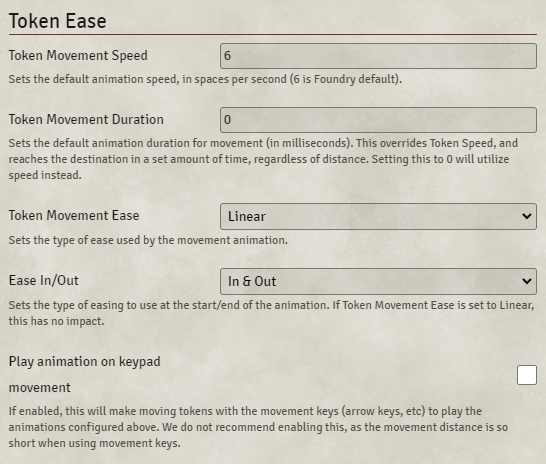

# Token Ease

This module extends native Foundry behavior to introduce easing, custom movement speed, and movement duration to tokens.

No more will you suffer the lethargic slog of transporting tokens across the canvas!

## Credits

* League of Extraordinary FoundryVTT Developers
* [Easing Functions Cheat Sheet](https://easings.net/) ([GitHub](https://github.com/ai/easings.net)) - Copyright © 2020 Andrey Sitnik and Ivan Solovev

## Download Here:

`https://github.com/FantasyCalendar/FoundryVTT-TokenEase/releases/latest/download/module.json`

## If you like what you see...

Check out our other projects:

* [Fantasy Calendar](https://app.fantasy-calendar.com/) - *Standalone* - All-in-One Fantasy Calendar Manager - Creation of calendars and time-tracking in your homebrew or pre-made campaign worlds has never been easier

* [Dungeon Generator](http://dungeon-generator.fantasy-calendar.com/) - *Standalone* - A simple dungeon generator with beautiful tiles from [Kristian Richards](https://www.patreon.com/csp_kris/posts)

* [Sequencer](https://github.com/fantasycalendar/FoundryVTT-Sequencer) - *Foundry VTT* - Building complex sequencers and animations doesn't have to be hard

## Module Settings

In the module settings, you can set the following options:



### Token Movement Speed

#### Default: 10

This sets the default animation speed of moving tokens, in spaces per second (10 is Foundry default).

### Token Movement Duration

#### Default: 0

This sets the default animation duration for token movement (in milliseconds).

This overrides **Token Movement Speed**, and causes tokens to reach their destination in a set amount of time, regardless of distance.

### Token Movement Ease

#### Default: Linear

This sets the type of ease used by the movement animation on tokens.

### Ease In/Out

#### Default: In & Out

This sets the type of easing to use at the start/end of the animation. If Token Movement Ease is set to Linear, this has no impact.

### Play animation on keypad movement

#### Default: False

If enabled, this will make moving tokens with the movement keys (arrow keys, etc) to play the animations configured above.

We do not recommend enabling this, as the movement distance is so short when using movement keys.

## API

### Changes to `Token.Document.Update`

This accepts an additional optional parameter in its second parameter:

```js
token.document.update({
     x: ..., y: ...
}, {animate: true, animation: { speed: 10, duration: 0, ease: "linear" }})
```

| Param | Type | Default |
| --- | --- | --- |
| speed | <code>number</code> | `10` |
| duration | <code>number</code> | `0` |
| ease | <code>string</code> | `linear` |

If `speed` or `duration` is given in the `animation` parameter, it will override the settings (see [module settings](#module-settings)).

If `duration` is provided, `speed` has no impact on the animation, as the token will reach the destination within the given duration.

---

### `window.easeFunctions`

A global object that contains all the ease functions for quick access.

Use like: `window.easeFunctions["linear"]`, which gives you:

```js
function linear(x) {
    return x;
}
```

### List of ease options:

 * `linear`
 * `easeInSine`
 * `easeOutSine`
 * `easeInOutSine`
 * `easeInQuad`
 * `easeOutQuad`
 * `easeInOutQuad`
 * `easeInCubic`
 * `easeOutCubic`
 * `easeInOutCubic`
 * `easeInQuart`
 * `easeOutQuart`
 * `easeInOutQuart`
 * `easeInQuint`
 * `easeOutQuint`
 * `easeInOutQuint`
 * `easeInExpo`
 * `easeOutExpo`
 * `easeInOutExpo`
 * `easeInCirc`
 * `easeOutCirc`
 * `easeInOutCirc`
 * `easeInBack`
 * `easeOutBack`
 * `easeInOutBack`
 * `easeInElastic`
 * `easeOutElastic`
 * `easeInOutElastic`
 * `easeInBounce`
 * `easeOutBounce`
 * `easeInOutBounce`