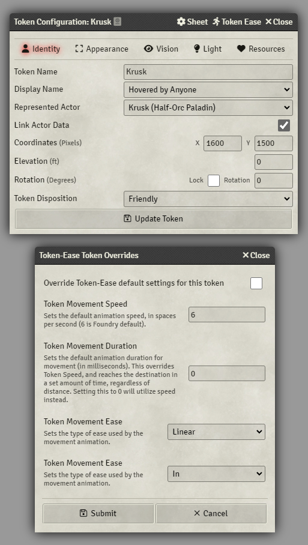

# Token Ease


---

 [](https://forge-vtt.com/bazaar#package=token-ease)  

---


A module made by [Fantasy Computerworks](http://fantasycomputer.works/).

Other works by us:
- [Fantasy Calendar](https://app.fantasy-calendar.com) - The best calendar creator and management app on the internet
- [Sequencer](https://foundryvtt.com/packages/sequencer) - Wow your players by playing visual effects on the canvas
- [Item Piles](https://foundryvtt.com/packages/item-piles) - Drag & drop items into the scene to drop item piles that you can then easily pick up
- [Tagger](https://foundryvtt.com/packages/tagger) - Tag objects in the scene and retrieve them with a powerful API

Like what we've done? Buy us a coffee!

<a href='https://ko-fi.com/H2H2LCCQ' target='_blank'></a>

---

## What is this?

This module changes Foundry token animation behavior to introduce customizable animations. You can configure custom easing, custom movement speed, and movement duration to tokens.

No more will you suffer the lethargic slog of transporting tokens across the canvas!

## Credits

* Kerrec Snowmane for his implementation of the hooks
* League of Extraordinary FoundryVTT Developers
* [Easing Functions Cheat Sheet](https://easings.net/) ([GitHub](https://github.com/ai/easings.net)) - Copyright © 2020 Andrey Sitnik and Ivan Solovev

## Download Here:

`https://github.com/fantasycalendar/FoundryVTT-TokenEase/releases/latest/download/module.json`


## Module Settings

In the module settings, you can set the following options:


### Token Movement Speed

#### Default: 10

This sets the default animation speed of moving tokens, in spaces per second (10 is Foundry default).

### Token Movement Duration

#### Default: 0

This sets the default animation duration for token movement (in milliseconds).

This overrides **Token Movement Speed**, and causes tokens to reach their destination in a set amount of time, regardless of distance.

### Token Movement Ease

#### Default: Linear

This sets the type of ease used by the movement animation on tokens.

### Ease In/Out

#### Default: In & Out

This sets the type of easing to use at the start/end of the animation. If Token Movement Ease is set to Linear, this has no impact.

### Play animation on keypad movement

#### Default: False

If enabled, this will make moving tokens with the movement keys (arrow keys, etc) to play the animations configured above.

We do not recommend enabling this, as the movement distance is so short when using movement keys.

## Token Settings

Each token can override the module's default movement animation settings.



## API

### Changes to `TokenDocument#update`

This accepts an additional optional parameter in its second parameter:

```js
token.document.update({
     x: ..., y: ...
}, {animate: true, animation: { speed: 10, duration: 0, ease: "linear" }})
```

| Param | Type | Default |
| --- | --- | --- |
| speed | <code>number</code> | `10` |
| duration | <code>number</code> | `0` |
| ease | <code>string</code> | `linear` |

If `speed` or `duration` is given in the `animation` parameter, it will override the settings (see [module settings](#module-settings)).

If `duration` is provided, `speed` has no impact on the animation, as the token will reach the destination within the given duration.

---

### `window.easeFunctions`

A global object that contains all the ease functions for quick access.

Use like: `window.easeFunctions["linear"]`, which gives you:

```js
function linear(x) {
    return x;
}
```

### List of ease options:

 * `linear`
 * `easeInSine`
 * `easeOutSine`
 * `easeInOutSine`
 * `easeInQuad`
 * `easeOutQuad`
 * `easeInOutQuad`
 * `easeInCubic`
 * `easeOutCubic`
 * `easeInOutCubic`
 * `easeInQuart`
 * `easeOutQuart`
 * `easeInOutQuart`
 * `easeInQuint`
 * `easeOutQuint`
 * `easeInOutQuint`
 * `easeInExpo`
 * `easeOutExpo`
 * `easeInOutExpo`
 * `easeInCirc`
 * `easeOutCirc`
 * `easeInOutCirc`
 * `easeInBack`
 * `easeOutBack`
 * `easeInOutBack`
 * `easeInElastic`
 * `easeOutElastic`
 * `easeInOutElastic`
 * `easeInBounce`
 * `easeOutBounce`
 * `easeInOutBounce`

## Hooks

### preTokenAnimate

Called before a token has started animating.

You can `return false` to interrupt the movement.

| Param | Type |
| --- | --- |
| context | <code>Token</code> |
| data | <code>object</code> |

<details>

<summary>Example hook</summary>

This hook injects more code into the animate callback (ontick).
The injected code adds a PIXI Graphics circle to the canvas every 100 or so pixels.

```js
Hooks.once('preTokenAnimate', (token, data) => {
    const tokenCenter = token.w/2;
    let lastPos = {
        x: token.data.x,
        y: token.data.y
    }
    data.ontick = (dt, anim) => {
        token._onMovementFrame(dt, anim, data.config);
        const currLoc = {
            x: token.data.x + tokenCenter,
            y: token.data.y + tokenCenter,
        }
        if (    Math.abs(lastPos.x - token.data.x) > 100 ||
                Math.abs(lastPos.y - token.data.y) > 100
        ) {
            const poopDot = new PIXI.Graphics();
            poopDot.beginFill(0xe74c3c);
            poopDot.drawCircle(currLoc.x, currLoc.y, 10);
            poopDot.endFill();
            canvas.background.addChild(poopDot);
            lastPos = {
                x: token.data.x,
                y: token.data.y
            }
        }
    }
});
```

This was a test to inject a function into the tokenAnimate callback that is added to the canvas ticker.

It will just generate a console log message on every tick.

```js
Hooks.once('preTokenAnimate', (token, data) => {
    const myNewVar = "YES!";
    data.ontick = (dt, anim) => {
        token._onMovementFrame(dt, anim, data.config);
        console.log("Have I added this console.log to the ontick function? ", myNewVar);
    }
    console.log("preTokenAnimate hook has fired!");
});
```

This hook will multiply the movement speed by 3.  It does this by dividing the duration by 3.

```js
Hooks.once('preTokenAnimate', (token, data) => {
    // This hook will make the token faster than normal.
    data.duration /= 3; 
})
```

</details>

### preTokenChainMove

Called before a token has started animating along several waypoints.

You can `return false` to interrupt the movement.

| Param | Type |
| --- | --- |
| token | <code>Token</code> |
| ruler | <code>Ruler</code> |

<details>

<summary>Example hook</summary>

This hook alters the waypoints of a token movement.  The intent was to have the token move between waypoints that I would enter in a zig-zag pattern.

The logic here is very wrong, but it still demonstrates that the waypoints can be changed via the hook.

```js
Hooks.once('preTokenChainMove', (token, ruler) => {
    for (let i=1; i < Ruler.waypoints.length - 1; i++) {
        ruler.waypoints[i].x = (ruler.waypoints[i].x + ruler.waypoints[i+1].x) / 2;
        ruler.waypoints[i].y = (ruler.waypoints[i].y + ruler.waypoints[i+1].y) / 2;
    }
})
```

This hook will cause token movement to be cancelled before it begins. This applies to movements entered via waypoints (hold ctrl and click path). The token will emote text in a chat bubble.

```js
Hooks.once('preTokenChainMove', (token) => {
    const bubble = new ChatLog;
    bubble.processMessage("Whoa!  Do you think I can remember all those waypoints!?");
    return false;
})
```

</details>

### tokenAnimationComplete

Called when a token's animation completed playing entirely.

| Param | Type |
| --- | --- |
| token | <code>Token</code> |

<details>

<summary>Example hook</summary>

This hook will emote text in a chat bubble, when an animation is complete.

```js
Hooks.once('tokenAnimationComplete', (token) => {
    const bubble = new ChatLog;
    bubble.processMessage("If you didn't drag me down into these places, I wouldn't have to strain myself running in full armor to get past these ridiculous obstacles you can't seem to avoid...")
})
```

</details>

### tokenAnimationTerminated

Called when a token's animation was terminated early, without having finished.

| Param | Type |
| --- | --- |
| attributes | <code>array</code> |

<details>

<summary>Example hook</summary>

This hook will spit out animation data at time of termination to the console.

It will also set the token's position at the spot where the animation was terminated.

Core sets the token position before animation starts, so terminating an animation in core sends the token to the end point.

```js
Hooks.once('tokenAnimationTerminated', (data) => {
    console.log("Token animation terminated early: ", data);
    ui.notifications.info("Notification triggered off the new 'tokenAnimationTerminated' hook.  See console for animation data!");
    const token = data[0].parent;
    const isToX = data.filter(d => d.attribute === "x");
    const isToY = data.filter(d => d.attribute === "y");
    
    const wasX = isToX.length ? (isToX[0].to - (isToX[0].delta - isToX[0].done)) : token.data.x;
    const wasY = isToY.length ? (isToY[0].to - (isToY[0].delta - isToY[0].done)) : token.data.y;
    
    token.position.set(wasX, wasY);
    
    token.document.update({_id: token.id, x: wasX, y: wasY}, {animate: false});
})
```

</details>
